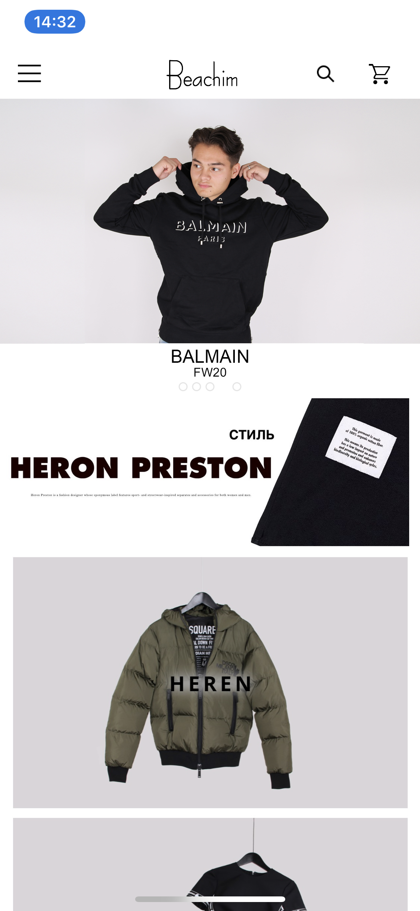

# Procesverslag

**Auteur:** -Ronan Doeleman-

Markdown cheat cheet: [Hulp bij het schrijven van Markdown](https://github.com/adam-p/markdown-here/wiki/Markdown-Cheatsheet). Nb. de standaardstructuur en de spartaanse opmaak zijn helemaal prima. Het gaat om de inhoud van je procesverslag. Besteedt de tijd voor pracht en praal aan je website.

## Bronnenlijst

1. www.beachim.nl
2. www.developer.mozilla.org
3. www.w3schools.com

## Eindgesprek (week 7/8)

Begonnen aan detailpagina opmaken. Heb een array gemaakt voor de image en animaties toegevoegd. Winkelmand functie toegevoegd.

**Screenshot(s):**

## Voortgang 3 (week 6)

Hamburgermenu (responsive) gemaakt. Content toegevoegd op de hoofdpagina. Nog niet begonnen aan de detailpagina.
### Verslag van meeting

Studentenassistent heeft goed uitgelegd hoe je media query's kan gebruiken.

## Voortgang 2 (week 5)

Code is nog rommelig. Loop achter op schema. Alleen footer en nav gemaakt.
Liep vast met het Hamburgermenu responsive maken en heb nog geen content toegevoegd aan de website. Dus ga nu content toevoegen.

### Verslag van meeting

Uitleg gekregen over hoe je een hamburgermenu tevoorschijn kan laten komen doormiddel van javascript.

## Voortgang 1 (week 3)

### Stand van zaken

Inenten kan beter.
Maak onderscheid tussen een content plaatje en een ... plaatje.
Geen tekst in een image plaatsen.
H2 in hetzelfde block als de image plaatsen en erboven laten zweven, hierdoor kan je hover effect e.t.c. toevoegen
Class names in het engels gebruiken. (gebruik passende inhoudelijke namen) 
Class names minimaliseren, gebruik article.

**Screenshot(s):**

(images/tekst.png)

### Agenda voor meeting

-samen met je groepje opstellen-

### Verslag van meeting

Grote delen van mijn code waren semantisch incorrect. Gelijk ook letten op het 
netjes maken van je code.

## Intake (week 1)

**Je startniveau:** -Blauw-

**Je focus:** -Surface-

**Je opdracht:** -Kledingwebsite van Beachim-

**Screenshot(s):**

(images/img_6151.PNG)

(images/homepagina1.PNG);

**Breakdown-schets(en):**

